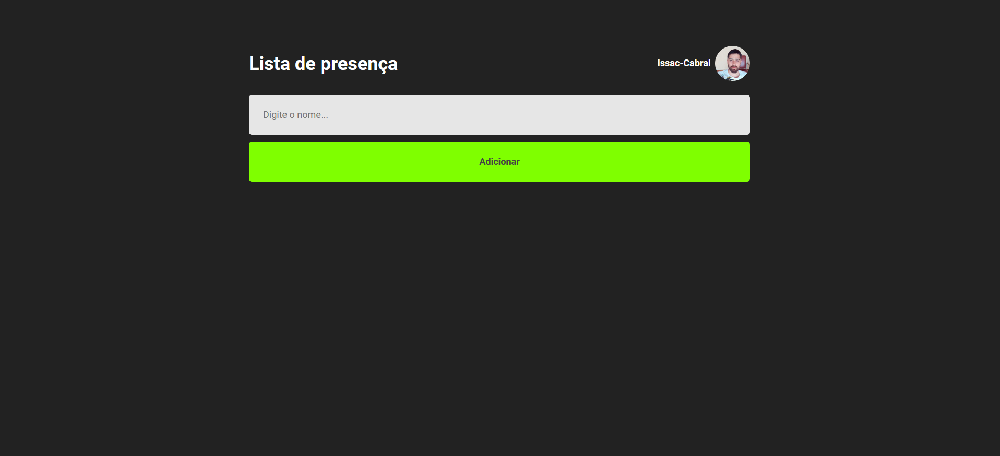
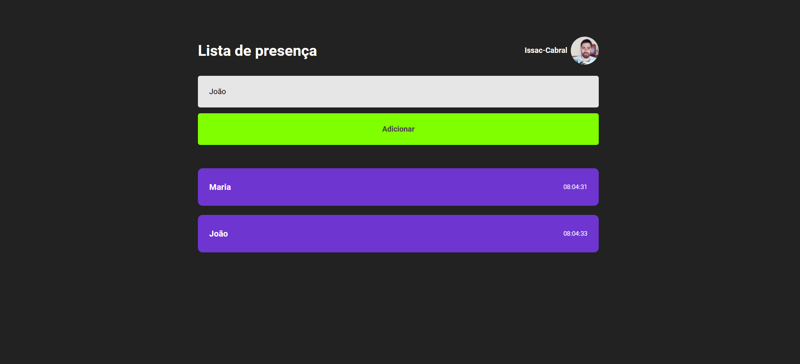

# Lista de Presença

Após 2 anos estudando backend, sinto que é necessário evoluir
ainda mais e estudar a outra stack. 

Esse projetinho foi um simples
primeiro passo para iniciar no front e estudando um pouco de react

## Assuntos abordados no projeto

- Importando arquivos CSS
- Estilizando
- Componentes
- Hooks de useEffect e useState
- Consumindo APIs externas com fetch
- Consumindo a API do Github para listagem de dados de um usuário

### Tela inicial

</img>

### Adicionando na lista...

</img>